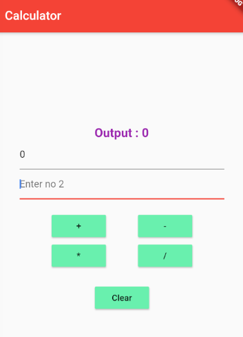

# calculatorapp

A simple flutter calculator that sums, subtracts, divides and multiples two numbers.

## Getting Started

For more information, visit the Flutter website.
- [flutter.dev](https://flutter.dev/docs/get-started/codelab)